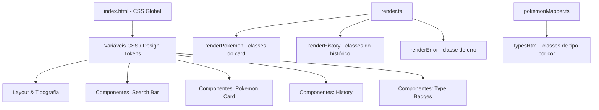
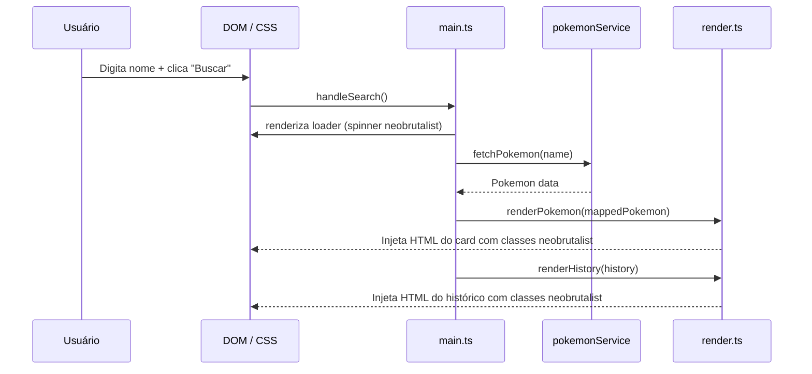
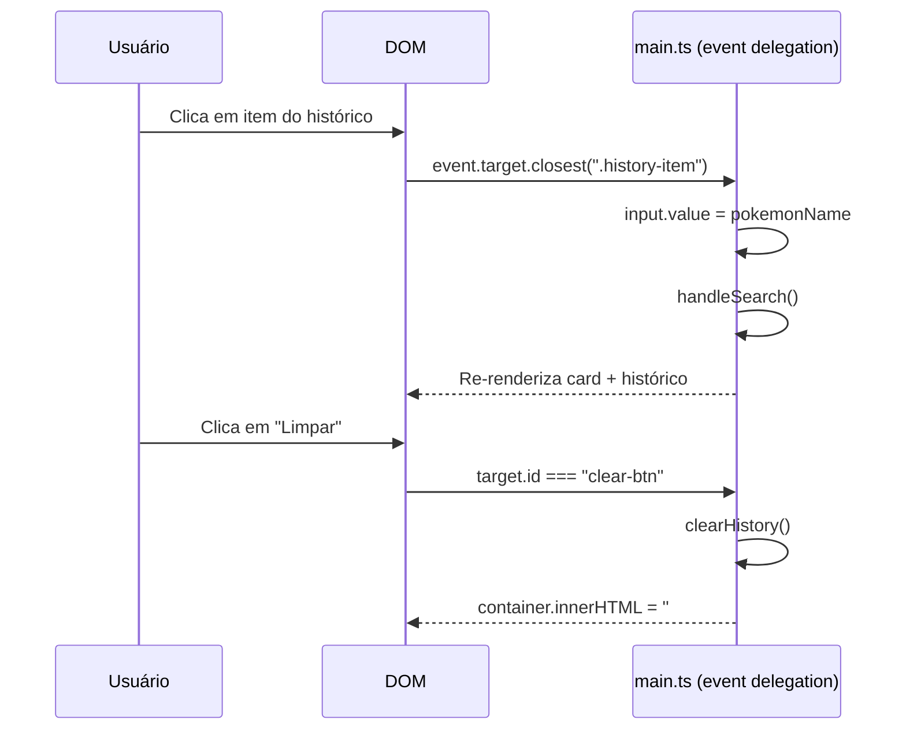

# Design Document: Neobrutalism UI Redesign

## Overview

Redesign completo da interface do Buscador de Pokémon, substituindo o estilo glassmorphism/dark atual pelo estilo **Neobrutalism**: bordas sólidas grossas, sombras offset sem blur, cores vibrantes, tipografia bold e elementos com aparência "flat" com profundidade via sombras.

O redesign é puramente visual — nenhuma lógica de negócio, serviços ou tipos TypeScript serão alterados. As mudanças se concentram em `index.html` (CSS) e `src/ui/render.ts` (classes HTML geradas dinamicamente), com ajustes pontuais em `src/mappers/pokemonMapper.ts` para as classes de tipo.

---

## Architecture

O projeto não possui bundler de CSS separado — todo o estilo vive em `<style>` dentro de `index.html`. A renderização dinâmica de HTML ocorre em `render.ts` e `pokemonMapper.ts`. A arquitetura de mudanças segue esse mesmo padrão:



---

## Sequence Diagrams

### Fluxo de busca com feedback visual Neobrutalism



### Interação com histórico



---

## Components and Interfaces

### Component 1: Search Bar

**Purpose**: Campo de entrada + botão de busca, ponto de entrada principal da interação.

**Interface HTML**:
```html
<div class="search-container">
  <input type="text" id="input" placeholder="Ex: pikachu" />
  <button id="btn">Buscar</button>
</div>
```

**Estilo Neobrutalism**:
- Container: `border: 3px solid #000`, `box-shadow: 4px 4px 0px #000`, fundo amarelo vibrante (`#FFE500`)
- Input: sem borda própria, fundo transparente, fonte bold
- Botão: `border: 3px solid #000`, `box-shadow: 4px 4px 0px #000`, fundo preto, texto branco
- Botão `:active`: `box-shadow: 0 0 0 #000`, `transform: translate(4px, 4px)` (efeito de pressionar)

**Responsabilidades**:
- Capturar input do usuário
- Disparar busca via click ou Enter
- Feedback visual de "pressionar" no botão

---

### Component 2: Pokemon Card

**Purpose**: Exibe os dados do Pokémon encontrado — imagem, tipos, medidas e stats.

**Interface HTML** (gerada por `render.ts`):
```html
<div class="pokemon-card">
  <div class="pokemon-card__header">
    <span class="pokemon-card__id">#025</span>
    <h2 class="pokemon-card__name">PIKACHU</h2>
  </div>
  
  <div class="types-container">
    <span class="type-badge type-electric">electric</span>
  </div>
  <div class="measurements">
    <div class="measurement-item">
      <span class="measurement-label">Altura</span>
      <span class="measurement-value">0.4m</span>
    </div>
    <div class="measurement-item">
      <span class="measurement-label">Peso</span>
      <span class="measurement-value">6.0kg</span>
    </div>
  </div>
  <div class="stats-container">
    <div class="stat-row">
      <span class="stat-name">HP</span>
      <div class="stat-bar-wrapper">
        <div class="stat-bar" style="width: 35%"></div>
      </div>
      <span class="stat-value">35</span>
    </div>
  </div>
</div>
```

**Estilo Neobrutalism**:
- Card: `border: 3px solid #000`, `box-shadow: 8px 8px 0px #000`, fundo branco, `border-radius: 0` (sem arredondamento)
- Header: fundo colorido (cor primária do tipo do Pokémon), texto bold
- Imagem: `border: 3px solid #000`, fundo colorido contrastante
- Stats: barras de progresso com `border: 2px solid #000`, preenchimento colorido sólido

**Responsabilidades**:
- Exibir todos os dados mapeados do Pokémon
- Aplicar cor temática baseada no tipo primário
- Animar entrada do card (`cardEnter`)

---

### Component 3: History List

**Purpose**: Lista de buscas recentes clicáveis para refazer a busca.

**Interface HTML** (gerada por `render.ts`):
```html
<div id="history">
  <div class="history-header">
    <span>Buscas recentes</span>
    <button id="clear-btn">Limpar</button>
  </div>
  <div class="history-list">
    <div class="history-item" data-name="pikachu">
      
      <div class="history-info">
        <span class="history-name">PIKACHU</span>
        <span class="history-id">#025</span>
      </div>
      <span class="history-time">14:32</span>
    </div>
  </div>
</div>
```

**Estilo Neobrutalism**:
- Header: texto uppercase bold, cor escura
- Botão "Limpar": `border: 2px solid #000`, `box-shadow: 2px 2px 0 #000`, fundo branco
- Item: `border: 2px solid #000`, `box-shadow: 3px 3px 0 #000`, fundo branco
- Item `:hover`: `transform: translate(-2px, -2px)`, `box-shadow: 5px 5px 0 #000`
- Item `:active`: `transform: translate(3px, 3px)`, `box-shadow: 0 0 0 #000`

**Responsabilidades**:
- Listar histórico de buscas
- Permitir reclique para refazer busca
- Botão "Limpar" para resetar histórico

---

### Component 4: Type Badges

**Purpose**: Exibir os tipos do Pokémon com cores características.

**Interface HTML** (gerada por `pokemonMapper.ts`):
```html
<span class="type-badge type-fire">fire</span>
<span class="type-badge type-flying">flying</span>
```

**Paleta de tipos — Neobrutalism** (cores vibrantes + borda preta):

| Tipo       | Background  | Texto  |
|------------|-------------|--------|
| normal     | `#A8A878`   | `#000` |
| fire       | `#FF4500`   | `#fff` |
| water      | `#4169E1`   | `#fff` |
| electric   | `#FFD700`   | `#000` |
| grass      | `#32CD32`   | `#000` |
| ice        | `#00CED1`   | `#000` |
| fighting   | `#DC143C`   | `#fff` |
| poison     | `#9400D3`   | `#fff` |
| ground     | `#DAA520`   | `#000` |
| flying     | `#87CEEB`   | `#000` |
| psychic    | `#FF1493`   | `#fff` |
| bug        | `#6B8E23`   | `#fff` |
| rock       | `#808080`   | `#fff` |
| ghost      | `#483D8B`   | `#fff` |
| dragon     | `#4B0082`   | `#fff` |
| dark       | `#2F2F2F`   | `#fff` |
| steel      | `#B0C4DE`   | `#000` |
| fairy      | `#FF69B4`   | `#000` |

**Estilo Neobrutalism**:
- `border: 2px solid #000`
- `border-radius: 0` (sem pill shape)
- `font-weight: 800`
- `text-transform: uppercase`
- `padding: 4px 12px`

---

### Component 5: Error State

**Purpose**: Feedback visual quando a busca falha.

**Interface HTML**:
```html
<div class="error-card">
  <span class="error-icon">✕</span>
  <p class="error-message">Pokémon não encontrado!</p>
</div>
```

**Estilo Neobrutalism**:
- `border: 3px solid #000`
- `box-shadow: 6px 6px 0 #000`
- Fundo vermelho vibrante (`#FF4444`)
- Texto branco bold

---

### Component 6: Loader

**Purpose**: Indicador de carregamento durante o fetch.

**Estilo Neobrutalism**:
- Substituir spinner circular por um elemento animado com bordas sólidas
- Quadrado com `border: 3px solid #000`, animação de rotação
- Ou texto pulsante "Buscando..." com fonte bold

---

## Data Models

Os modelos TypeScript existentes não mudam. O mapper precisa de ajuste apenas na geração de HTML dos tipos e stats:

### MappedPokemon (sem alteração de interface)

```typescript
interface MappedPokemon {
  name: string        // ex: "PIKACHU"
  displayId: string   // ex: "#025"
  imageUrl: string    // URL do sprite
  typesHtml: string   // HTML dos badges de tipo
  heightText: string  // ex: "0.4m"
  weightText: string  // ex: "6.0kg"
  statsHtml: string   // HTML das linhas de stat
}
```

### Mudança em `statsHtml` — adicionar barra de progresso

O mapper atual gera apenas nome + valor. O novo design inclui uma barra visual:

```typescript
// Valor máximo de referência por stat (para calcular %)
const STAT_MAX: Record<string, number> = {
  hp: 255,
  attack: 190,
  defense: 230,
  'special-attack': 194,
  'special-defense': 230,
  speed: 200,
}

// Nova geração de statsHtml
statsHtml: apiData.stats.map(s => {
  const max = STAT_MAX[s.stat.name] ?? 255
  const pct = Math.round((s.base_stat / max) * 100)
  return `
    <div class="stat-row">
      <span class="stat-name">${s.stat.name}</span>
      <div class="stat-bar-wrapper">
        <div class="stat-bar" style="width: ${pct}%"></div>
      </div>
      <span class="stat-value">${s.base_stat}</span>
    </div>
  `
}).join('')
```

---

## Design Tokens (CSS Custom Properties)

Centralizar os valores visuais como variáveis CSS para consistência:

```css
:root {
  /* Cores base */
  --color-black: #000000;
  --color-white: #FFFFFF;
  --color-bg: #F5F0E8;        /* fundo creme/off-white */
  --color-accent: #FFE500;    /* amarelo vibrante (search bar) */
  --color-error: #FF4444;

  /* Sombras offset (neobrutalism signature) */
  --shadow-sm: 3px 3px 0px var(--color-black);
  --shadow-md: 5px 5px 0px var(--color-black);
  --shadow-lg: 8px 8px 0px var(--color-black);

  /* Bordas */
  --border: 3px solid var(--color-black);
  --border-thin: 2px solid var(--color-black);

  /* Tipografia */
  --font-family: 'Space Grotesk', 'Inter', sans-serif;
  --font-weight-bold: 700;
  --font-weight-black: 900;

  /* Transições */
  --transition-press: transform 0.08s ease, box-shadow 0.08s ease;
}
```

---

## Algorithmic Pseudocode

### Algoritmo: Aplicar cor temática ao card baseada no tipo primário

```pascal
PROCEDURE applyTypeTheme(card, primaryType)
  INPUT: card (HTMLElement), primaryType (string)
  OUTPUT: card com cor de fundo temática aplicada

  SEQUENCE
    colorMap ← TYPE_COLOR_MAP  // mapeamento tipo → cor hex
    
    IF primaryType IN colorMap THEN
      themeColor ← colorMap[primaryType]
    ELSE
      themeColor ← "#A8A878"  // fallback: normal
    END IF
    
    header ← card.querySelector(".pokemon-card__header")
    header.style.backgroundColor ← themeColor
    
    imgWrapper ← card.querySelector(".pokemon-img-wrapper")
    imgWrapper.style.backgroundColor ← lighten(themeColor, 20%)
  END SEQUENCE
END PROCEDURE
```

**Precondições:**
- `card` é um elemento DOM válido com as classes esperadas
- `primaryType` é uma string não vazia

**Pós-condições:**
- O header do card tem `backgroundColor` definido
- A cor aplicada é consistente com o tipo do Pokémon

---

### Algoritmo: Efeito de pressionar botão (press effect)

```pascal
PROCEDURE applyPressEffect(button)
  INPUT: button (HTMLElement com --shadow-md definido)
  OUTPUT: comportamento visual de "pressionar"

  ON mousedown DO
    button.style.transform ← "translate(4px, 4px)"
    button.style.boxShadow ← "0 0 0 #000"
  END ON

  ON mouseup OR mouseleave DO
    button.style.transform ← "translate(0, 0)"
    button.style.boxShadow ← var(--shadow-md)
  END ON
END PROCEDURE
```

**Precondições:**
- Botão tem `box-shadow` offset definido via CSS
- Botão tem `transition: var(--transition-press)` aplicado

**Pós-condições:**
- Ao pressionar: sombra some, elemento "afunda" 4px
- Ao soltar: sombra e posição restauradas

---

### Algoritmo: Calcular largura da barra de stat

```pascal
FUNCTION calcStatBarWidth(statValue, statName)
  INPUT: statValue (integer 1..255), statName (string)
  OUTPUT: percentage (integer 1..100)

  SEQUENCE
    maxValues ← { hp: 255, attack: 190, defense: 230,
                   special-attack: 194, special-defense: 230, speed: 200 }
    
    IF statName IN maxValues THEN
      maxVal ← maxValues[statName]
    ELSE
      maxVal ← 255
    END IF
    
    percentage ← FLOOR((statValue / maxVal) * 100)
    percentage ← CLAMP(percentage, 1, 100)
    
    RETURN percentage
  END SEQUENCE
END FUNCTION
```

**Precondições:**
- `statValue` é inteiro positivo (garantido pela PokéAPI)
- `statName` é string válida

**Pós-condições:**
- Retorna valor entre 1 e 100 (nunca 0% para não sumir visualmente)
- Valor é proporcional ao máximo histórico do stat

---

## Key Functions with Formal Specifications

### `renderPokemon(pokemon: MappedPokemon): void`

**Precondições:**
- `document.getElementById("result")` existe no DOM
- `pokemon` é um `MappedPokemon` válido e completamente preenchido
- `pokemon.imageUrl` é uma URL válida de imagem

**Pós-condições:**
- `#result` contém exatamente um `.pokemon-card`
- O card contém: nome, ID, imagem, tipos, medidas e stats
- A animação `cardEnter` é disparada (via classe CSS)
- Nenhum estado externo é mutado

**Loop Invariants:** N/A (sem loops)

---

### `renderHistory(history: readonly SearchHistory[]): void`

**Precondições:**
- `document.getElementById("history")` existe no DOM
- `history` é um array readonly (pode ser vazio)

**Pós-condições:**
- Se `history.length === 0`: `#history` fica vazio (`innerHTML = ''`)
- Se `history.length > 0`: `#history` contém `.history-header` e `.history-list`
- Cada item tem `data-name` com o nome em lowercase para event delegation
- O botão `#clear-btn` está presente e acessível via event delegation

**Loop Invariants:**
- Para cada `entry` em `history`: o HTML gerado contém `data-name` correspondente

---

### `mapPokemonToUI(apiData: Pokemon): MappedPokemon`

**Precondições:**
- `apiData` é um objeto `Pokemon` válido retornado pela PokéAPI
- `apiData.stats` tem pelo menos 1 elemento
- `apiData.types` tem pelo menos 1 elemento

**Pós-condições:**
- `typesHtml` contém `<span>` com classes `type-badge type-{typeName}` para cada tipo
- `statsHtml` contém `<div class="stat-row">` com barra de progresso para cada stat
- `displayId` está no formato `#NNN` (3 dígitos com zero-padding)
- Nenhuma mutação em `apiData`

---

## Example Usage

### Renderização do card após busca bem-sucedida

```typescript
// main.ts — fluxo existente, sem alteração
const rawPokemon = await fetchPokemon("charizard");
const mappedPokemon = mapPokemonToUI(rawPokemon);
renderPokemon(mappedPokemon);

// Resultado esperado no DOM:
// <div class="pokemon-card">
//   <div class="pokemon-card__header" style="background-color: #FF4500">
//     <span class="pokemon-card__id">#006</span>
//     <h2 class="pokemon-card__name">CHARIZARD</h2>
//   </div>
//   <div class="pokemon-img-wrapper">
//     
//   </div>
//   <div class="types-container">
//     <span class="type-badge type-fire">FIRE</span>
//     <span class="type-badge type-flying">FLYING</span>
//   </div>
//   ...
// </div>
```

### Barra de stat calculada

```typescript
// Para Charizard: HP = 78
// calcStatBarWidth(78, "hp") → floor(78/255 * 100) = 30%
// <div class="stat-bar" style="width: 30%"></div>

// Para Charizard: Speed = 100
// calcStatBarWidth(100, "speed") → floor(100/200 * 100) = 50%
// <div class="stat-bar" style="width: 50%"></div>
```

### Efeito de pressionar via CSS puro

```css
/* Preferência: usar CSS :active em vez de JS para o press effect */
.btn-neobrutalist:active {
  transform: translate(4px, 4px);
  box-shadow: 0 0 0 #000;
}
```

---

## Correctness Properties

*A property is a characteristic or behavior that should hold true across all valid executions of a system — essentially, a formal statement about what the system should do. Properties serve as the bridge between human-readable specifications and machine-verifiable correctness guarantees.*

### Property 1: Barra de stat sempre dentro do intervalo válido

*For any* `statValue` entre 1 e 255 e qualquer `statName` (conhecido ou desconhecido), `calcStatBarWidth` SHALL retornar um inteiro entre 1 e 100 inclusive — nunca 0% (invisível) e nunca acima de 100% (overflow).

**Validates: Requirements 4.2, 4.3, 4.4**

---

### Property 2: typesHtml contém exatamente um badge por tipo

*For any* array de tipos retornado pela PokéAPI (com 1 ou mais elementos), `mapPokemonToUI` SHALL gerar `typesHtml` contendo exatamente um `<span class="type-badge type-{typeName}">` para cada tipo no array — nem mais, nem menos.

**Validates: Requirements 5.1, 10.4**

---

### Property 3: Fallback de tipo desconhecido

*For any* tipo não presente na paleta de 18 tipos definida no design, o HTML gerado SHALL conter a classe `type-normal` como fallback, garantindo que nenhum badge fique sem estilo visual.

**Validates: Requirements 5.3**

---

### Property 4: Idempotência de renderPokemon

*For any* `MappedPokemon` válido, chamar `renderPokemon(p)` múltiplas vezes com o mesmo `p` SHALL sempre produzir HTML idêntico em `#result` — sem acumulação de elementos ou estado residual.

**Validates: Requirements 3.6**

---

### Property 5: renderPokemon sempre produz exatamente um .pokemon-card

*For any* `MappedPokemon` válido, após chamar `renderPokemon`, o elemento `#result` SHALL conter exatamente um elemento `.pokemon-card` — nunca zero, nunca mais de um.

**Validates: Requirements 3.1**

---

### Property 6: statsHtml contém uma .stat-row por stat com barra proporcional

*For any* `Pokemon` com N stats (N ≥ 1), `mapPokemonToUI` SHALL gerar `statsHtml` contendo exatamente N elementos `.stat-row`, cada um com um `.stat-bar` cujo atributo `style` contém `width` entre 1% e 100%.

**Validates: Requirements 4.1**

---

### Property 7: renderHistory preserva data-name de cada entrada

*For any* array de histórico com N entradas (N ≥ 1), `renderHistory` SHALL gerar exatamente N elementos `.history-item`, cada um com `data-name` igual ao nome do Pokémon em lowercase correspondente à entrada.

**Validates: Requirements 6.1, 6.7**

---

### Property 8: mapPokemonToUI não muta o objeto de entrada

*For any* objeto `Pokemon` válido, chamar `mapPokemonToUI(apiData)` SHALL retornar um novo `MappedPokemon` sem modificar nenhuma propriedade de `apiData`.

**Validates: Requirements 10.2**

---

### Property 9: displayId sempre no formato #NNN

*For any* Pokémon com qualquer `id` inteiro positivo, `mapPokemonToUI` SHALL retornar `displayId` no formato `#NNN` com exatamente 3 dígitos e zero-padding (ex: `#001`, `#025`, `#150`).

**Validates: Requirements 10.3**

---

### Property 10: renderError sempre injeta .error-card em #result

*For any* string de mensagem de erro (incluindo strings vazias e strings com caracteres especiais), `renderError` SHALL injetar exatamente um elemento `.error-card` em `#result`.

**Validates: Requirements 7.1**

---

## Error Handling

### Erro 1: Pokémon não encontrado (404)

**Condição**: `fetchPokemon` lança `Error("Pokémon não encontrado!")` quando a API retorna 404.

**Resposta**: `renderError` injeta `.error-card` com estilo Neobrutalism (fundo vermelho, borda preta, sombra offset).

**Recuperação**: Usuário pode digitar outro nome. O card de erro é substituído na próxima busca bem-sucedida.

---

### Erro 2: Tipo de Pokémon sem classe CSS mapeada

**Condição**: PokéAPI retorna um tipo não listado na paleta (improvável, mas possível em gerações futuras).

**Resposta**: A classe `type-{name}` não terá estilo específico. O badge ficará sem cor de fundo definida.

**Recuperação**: Adicionar regra CSS de fallback: `.type-badge { background-color: #A8A878; }` como base, sobrescrita pelas classes específicas.

---

### Erro 3: Imagem do sprite indisponível

**Condição**: `pokemon.imageUrl` é `null` (alguns Pokémon antigos não têm sprite front_default).

**Resposta**: O `` exibe o placeholder padrão do browser.

**Recuperação**: Adicionar `onerror` no `` para exibir um placeholder Neobrutalism (quadrado com "?" bold).

---

## Testing Strategy

### Unit Testing Approach

Testar as funções puras de mapeamento e cálculo:

- `calcStatBarWidth(statValue, statName)`: valores de borda (1, 255), tipos conhecidos e desconhecidos
- `mapPokemonToUI(apiData)`: verificar que `typesHtml` contém as classes corretas, `statsHtml` contém `.stat-bar`, `displayId` tem formato correto
- `renderPokemon(pokemon)`: verificar que `#result` contém `.pokemon-card` após chamada

### Property-Based Testing Approach

**Property Test Library**: fast-check

Propriedades a testar:

```typescript
// Propriedade 1: barra de stat sempre entre 1 e 100
fc.assert(fc.property(
  fc.integer({ min: 1, max: 255 }),
  fc.constantFrom('hp', 'attack', 'defense', 'speed'),
  (value, name) => {
    const pct = calcStatBarWidth(value, name)
    return pct >= 1 && pct <= 100
  }
))

// Propriedade 2: typesHtml sempre contém type-badge para cada tipo
fc.assert(fc.property(
  fc.array(fc.constantFrom('fire','water','grass','electric'), { minLength: 1, maxLength: 2 }),
  (types) => {
    const html = generateTypesHtml(types)
    return types.every(t => html.includes(`type-${t}`))
  }
))
```

### Integration Testing Approach

- Simular busca completa (mock de `fetchPokemon`) e verificar que o DOM final contém todos os elementos esperados com as classes Neobrutalism corretas
- Verificar que clicar em `.history-item` re-dispara a busca corretamente após o redesign

---

## Performance Considerations

- O CSS inline em `index.html` continua sendo a abordagem — sem impacto de carregamento adicional
- A fonte `Space Grotesk` (Google Fonts) adiciona ~1 request HTTP; pode ser combinada com `Inter` já carregada via `font-display: swap`
- As animações CSS (`cardEnter`, press effect) usam `transform` e `box-shadow` — propriedades que não causam reflow, apenas repaint/composite
- As barras de stat usam `width` inline calculado no mapper — sem cálculo em runtime no DOM

---

## Security Considerations

- O HTML gerado dinamicamente em `render.ts` e `pokemonMapper.ts` usa dados vindos da PokéAPI. Os campos `name`, `stat.name` e `type.name` são strings controladas pela API — baixo risco de XSS, mas recomendado sanitizar antes de injetar via `innerHTML` em produção
- Nenhuma credencial ou dado sensível é manipulado neste redesign

---

## Dependencies

- **Google Fonts**: `Space Grotesk` (tipografia principal Neobrutalism) — substituir ou complementar `Inter`
  - URL: `https://fonts.googleapis.com/css2?family=Space+Grotesk:wght@400;700;900&display=swap`
- **Sem novas dependências npm**: o redesign é 100% CSS + ajustes de HTML gerado
- **PokéAPI**: sem alteração de contrato
- **TypeScript 5.x**: sem alteração de versão
