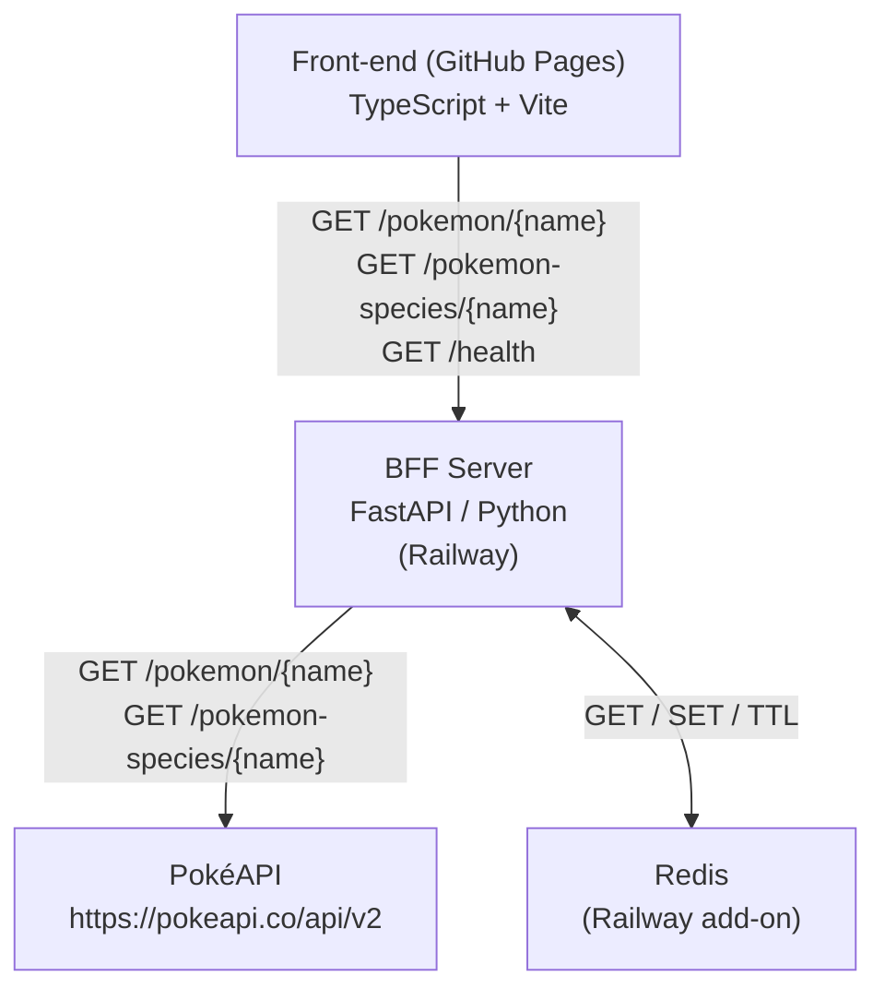
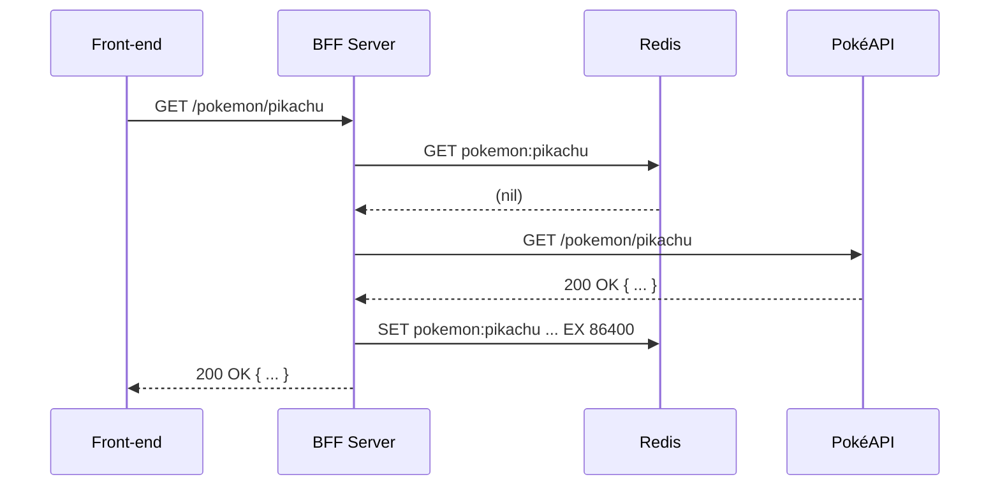
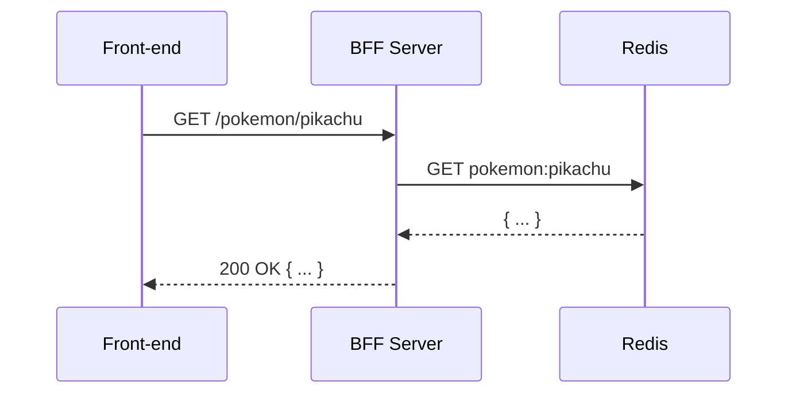

# Design Document — pokemon-bff-redis

## Overview

O BFF (Backend For Frontend) é um servidor FastAPI em Python que atua como proxy entre o front-end TypeScript (GitHub Pages) e a PokéAPI pública. Ele adiciona uma camada de cache Redis para reduzir latência e dependência da PokéAPI, além de centralizar tratamento de erros e CORS.

O back-end reside em `/backend` dentro do monorepo existente e é deployado no Railway. O front-end é atualizado para apontar suas chamadas HTTP ao BFF em vez de diretamente à PokéAPI.

---

## Architecture



**Fluxo de uma requisição com cache miss:**



**Fluxo com cache hit:**



---

## Components and Interfaces

### Estrutura de pastas do `/backend`

```
backend/
├── app/
│   ├── __init__.py
│   ├── main.py            # Criação do app FastAPI, CORS, routers
│   ├── config.py          # Leitura de variáveis de ambiente (pydantic-settings)
│   ├── dependencies.py    # Dependências injetáveis (Redis client)
│   ├── routers/
│   │   ├── __init__.py
│   │   ├── pokemon.py     # GET /pokemon/{name}
│   │   ├── species.py     # GET /pokemon-species/{name}
│   │   └── health.py      # GET /health
│   └── services/
│       ├── __init__.py
│       ├── cache.py       # Abstração de leitura/escrita no Redis
│       └── pokeapi.py     # Chamadas HTTP à PokéAPI (httpx async)
├── tests/
│   ├── __init__.py
│   ├── test_pokemon.py
│   ├── test_species.py
│   ├── test_health.py
│   └── test_cache.py
├── Dockerfile
├── requirements.txt
└── docker-compose.yml     # (na raiz do monorepo)
```

### Interfaces principais

#### `app/config.py`

```python
class Settings(BaseSettings):
    redis_url: str                          # obrigatório
    pokeapi_base_url: str = "https://pokeapi.co/api/v2"
    cache_ttl_seconds: int = 86400
    allowed_origins: str = "*"
    port: int = 8000

    model_config = SettingsConfigDict(env_file=".env")
```

#### `app/services/cache.py`

```python
async def get(redis: Redis, key: str) -> dict | None: ...
async def set(redis: Redis, key: str, value: dict, ttl: int) -> None: ...
```

#### `app/services/pokeapi.py`

```python
async def fetch_pokemon(name: str, base_url: str) -> dict: ...
async def fetch_species(name: str, base_url: str) -> dict: ...
```

Ambas as funções levantam:
- `PokeAPINotFoundError` — quando a PokéAPI retorna 404
- `PokeAPIUpstreamError` — quando a PokéAPI retorna outro status >= 400
- `PokeAPIUnavailableError` — quando não há conexão (timeout / connection error)

#### `app/routers/pokemon.py` e `app/routers/species.py`

Padrão de handler:

```python
@router.get("/{name}")
async def get_pokemon(name: str, redis=Depends(get_redis), settings=Depends(get_settings)):
    key = normalize(name)
    cached = await cache.get(redis, f"pokemon:{key}")
    if cached:
        return cached
    data = await pokeapi.fetch_pokemon(key, settings.pokeapi_base_url)
    await cache.set(redis, f"pokemon:{key}", data, settings.cache_ttl_seconds)
    return data
```

#### `app/routers/health.py`

```python
@router.get("/health")
async def health(redis=Depends(get_redis)):
    redis_status = "ok" if await ping_redis(redis) else "unavailable"
    return {"status": "ok", "redis": redis_status}
```

---

## Data Models

### Chaves Redis

| Endpoint                    | Chave Redis                  | TTL                    |
|-----------------------------|------------------------------|------------------------|
| `GET /pokemon/{name}`       | `pokemon:{name_normalizado}` | `CACHE_TTL_SECONDS`    |
| `GET /pokemon-species/{name}` | `species:{name_normalizado}` | `CACHE_TTL_SECONDS`  |

O valor armazenado é o JSON bruto retornado pela PokéAPI, serializado como string.

### Normalização do identificador

```
normalize(identifier):
  if identifier is numeric → return identifier as-is (string)
  else → return identifier.strip().lower()
```

Exemplos: `"Pikachu"` → `"pikachu"`, `"25"` → `"25"`, `"BULBASAUR"` → `"bulbasaur"`

### Respostas de erro padronizadas

| Situação                          | Status HTTP | Corpo                                                        |
|-----------------------------------|-------------|--------------------------------------------------------------|
| Pokémon não encontrado (404)      | 404         | `{"detail": "Pokémon não encontrado."}`                      |
| Espécie não encontrada (404)      | 404         | `{"detail": "Espécie não encontrada."}`                      |
| PokéAPI retornou erro inesperado  | 502         | `{"detail": "Erro ao consultar a PokéAPI."}`                 |
| PokéAPI inacessível               | 503         | `{"detail": "PokéAPI indisponível. Tente novamente mais tarde."}` |
| Redis inacessível                 | 503         | `{"detail": "Cache indisponível. Tente novamente mais tarde."}` |

### Variáveis de ambiente

| Variável            | Obrigatória | Padrão                          | Descrição                          |
|---------------------|-------------|----------------------------------|------------------------------------|
| `REDIS_URL`         | Sim         | —                                | URL de conexão ao Redis            |
| `POKEAPI_BASE_URL`  | Não         | `https://pokeapi.co/api/v2`      | URL base da PokéAPI                |
| `CACHE_TTL_SECONDS` | Não         | `86400`                          | TTL do cache em segundos           |
| `ALLOWED_ORIGINS`   | Não         | `*`                              | Origens CORS permitidas            |
| `PORT`              | Não         | `8000`                           | Porta de escuta do servidor        |

---

## Correctness Properties

*A property is a characteristic or behavior that should hold true across all valid executions of a system — essentially, a formal statement about what the system should do. Properties serve as the bridge between human-readable specifications and machine-verifiable correctness guarantees.*

### Property 1: Cache hit evita chamada à PokéAPI

*For any* identificador de Pokémon válido, se uma entrada para esse identificador já existir no Redis, o BFF deve retornar os dados do cache sem realizar nenhuma chamada HTTP à PokéAPI.

**Validates: Requirements 1.2, 2.2**

---

### Property 2: Cache miss popula o Redis

*For any* identificador de Pokémon válido que não esteja no cache, após uma requisição bem-sucedida ao BFF, o Redis deve conter uma entrada para aquele identificador com TTL maior que zero.

**Validates: Requirements 1.3, 2.3, 3.1**

---

### Property 3: Normalização de identificador é idempotente

*For any* string de identificador (maiúsculas, minúsculas ou mista), a função de normalização deve produzir sempre o mesmo resultado, e aplicá-la duas vezes deve produzir o mesmo resultado que aplicá-la uma vez.

**Validates: Requirements 4.1, 4.3**

---

### Property 4: Identificadores equivalentes compartilham a mesma chave de cache

*For any* par de identificadores que se diferenciem apenas por capitalização (ex: `"Pikachu"` e `"pikachu"`), ambos devem resultar na mesma chave Redis, de forma que um cache hit para um seja cache hit para o outro.

**Validates: Requirements 4.3**

---

### Property 5: Respostas de erro seguem o contrato definido

*For any* condição de erro (404, 5xx, timeout), o BFF deve retornar exatamente o status HTTP e o corpo JSON especificados no contrato, independentemente do identificador utilizado na requisição.

**Validates: Requirements 1.4, 1.5, 1.6, 2.4, 2.5, 2.6, 3.5**

---

## Error Handling

### Hierarquia de exceções customizadas

```python
class PokeAPIError(Exception): ...
class PokeAPINotFoundError(PokeAPIError): ...   # 404 da PokéAPI
class PokeAPIUpstreamError(PokeAPIError): ...   # 4xx/5xx inesperado
class PokeAPIUnavailableError(PokeAPIError): ... # timeout / connection error
class CacheUnavailableError(Exception): ...      # Redis inacessível
```

### Exception handlers globais (FastAPI)

```python
@app.exception_handler(PokeAPINotFoundError)
async def not_found_handler(...) -> JSONResponse:
    return JSONResponse(status_code=404, content={"detail": "..."})

@app.exception_handler(PokeAPIUpstreamError)
async def upstream_handler(...) -> JSONResponse:
    return JSONResponse(status_code=502, content={"detail": "Erro ao consultar a PokéAPI."})

@app.exception_handler(PokeAPIUnavailableError)
async def unavailable_handler(...) -> JSONResponse:
    return JSONResponse(status_code=503, content={"detail": "PokéAPI indisponível. Tente novamente mais tarde."})

@app.exception_handler(CacheUnavailableError)
async def cache_handler(...) -> JSONResponse:
    return JSONResponse(status_code=503, content={"detail": "Cache indisponível. Tente novamente mais tarde."})
```

### Inicialização

- Se `REDIS_URL` não estiver definida → log de erro + `sys.exit(1)`
- Se a conexão inicial ao Redis falhar → log de erro + `sys.exit(1)`
- Se `CACHE_TTL_SECONDS` não for um inteiro positivo → log de aviso + usa padrão `86400`

---

## Testing Strategy

### Abordagem dual

- **Testes unitários**: cobrem exemplos concretos, casos de borda e contratos de erro
- **Testes de propriedade**: verificam invariantes universais com entradas geradas aleatoriamente (via [Hypothesis](https://hypothesis.readthedocs.io/))

### Testes unitários

Usando `pytest` + `httpx.AsyncClient` + `pytest-asyncio`:

- `test_pokemon.py`: cache hit, cache miss, 404, 502, 503 (PokéAPI), 503 (Redis)
- `test_species.py`: mesmos cenários para `/pokemon-species/{name}`
- `test_health.py`: Redis ok, Redis unavailable
- `test_cache.py`: get/set, TTL, serialização/deserialização

Redis é mockado com `fakeredis` para testes unitários. PokéAPI é mockada com `respx`.

### Testes de propriedade (Hypothesis)

Mínimo de 100 iterações por propriedade. Cada teste referencia a propriedade do design com um comentário:

```python
# Feature: pokemon-bff-redis, Property 3: Normalização de identificador é idempotente
@given(st.text(min_size=1))
def test_normalize_idempotent(name):
    assert normalize(normalize(name)) == normalize(name)
```

| Propriedade | Arquivo de teste         | Estratégia Hypothesis                                      |
|-------------|--------------------------|-------------------------------------------------------------|
| Property 1  | `test_pokemon.py`        | `st.text()` para nomes; mock Redis retorna hit             |
| Property 2  | `test_pokemon.py`        | `st.text()` para nomes; mock Redis retorna miss            |
| Property 3  | `test_cache.py`          | `st.text()` para identificadores                           |
| Property 4  | `test_cache.py`          | `st.text()` + variações de capitalização                   |
| Property 5  | `test_pokemon.py`        | `st.sampled_from([404, 500, 503])` para status de erro     |

### Testes de integração

- Executados com Redis real (via `docker compose`)
- Cobrem: round-trip completo (BFF → PokéAPI → Redis → resposta), expiração de TTL, CORS preflight

### Cobertura mínima esperada

- Linhas: ≥ 90%
- Branches: ≥ 85%
